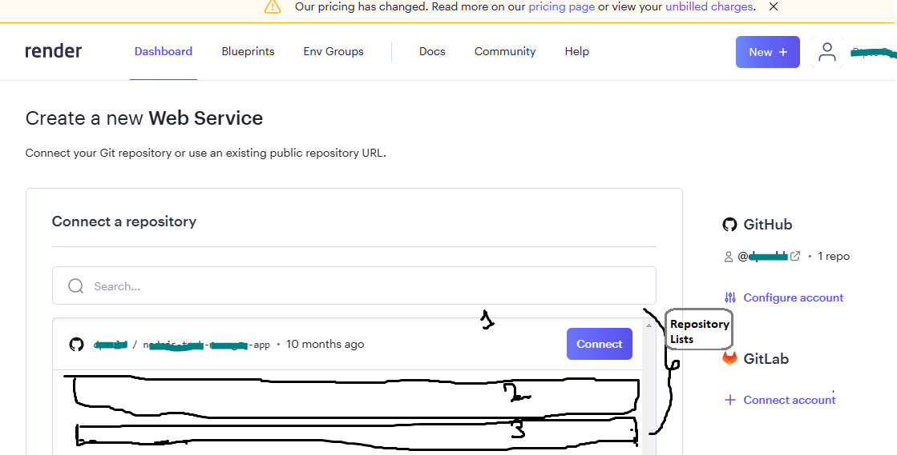
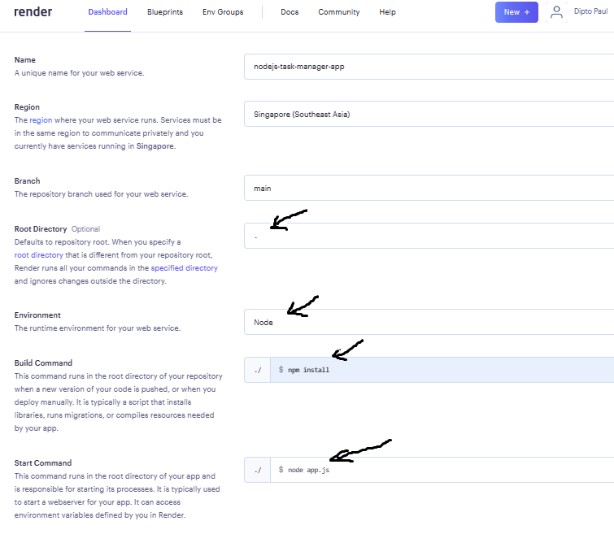

# Task Manager - A nodejs and mongodb based project

<!--
[Task Manager](https://nodejs-task-manager-dpauld.herokuapp.com/) -->

[Task Manager](https://nodejs-task-manager-app.onrender.com/)


Further information about Task Manager project is available in the [doc](https://github.com/dpauld/node-express-johnsmilga/blob/main/03-task-manager/starter/README.md) section.

## Clone this project

1. Clone the project in your local repository from Github
2. Install all the node modules using `npm install` command or install the required package individually.
3. Uncomment `require("dotenv").config()` line of `app.js` to run it locally. On the other hand, If you plan to deploy, comment this line of code to avoid port conflict. In case of running locally create a new file for setting up environment varibale, name it `.env`. Then assign `PORT = 3000` and `MONGODB_URI = "<your mongodb database connection string>"` inside the `.env` file.
<!--
4. [Optional] If `node_modules` is added in `.gitignore` file, then dont have it in `.gitigone` file. This way the node_modules will get deployed in the server. You may face error if you dont deploy the `node_modules` folder in the server.
   -->

## To Deploy This project in Render(free tier), follow these steps,

1. Signin/Signup to Render
2. Click `New > Webservices`, at this point they will ask you to connect github or gitlab with render, connect them so that you can give the app access to your apps stored in git repository. Once render is connected to your github account you will see a list of git repositories shown at render. Such as: 
3. Now to deploy the app click on the `connect` button just beside your target apps git repository shown in the list of render website.
4. Now fill up the fields accordingly, 
5. Click advance and then add environment variable related to database. It is important to Add the environment variables. This project use mongodb, so add a config variable for mongodb connection string. `key = MONGODB_URI` and `value=your mongodb database connection string`. 
6. Lastly Click on Create Web Service, within few minutes app will be deployed and will generate a url. Click on the URL to visit your live app.

## (Heroku is not free anymore) To Deploy This project in Heroku, follow these steps,

1. Download and install the `Heroku CLI`.
2. Open your terminal and write the following command lines, It will open the browser and take you to heroku website for Log in. Now, Log in to your Heroku account and it will automatically give your local machine the login access and perform any modification. Eralier, you need to Follow the prompts to create a new SSH public key.

```
$ heroku login
```

3. Deploy your changes. Make some changes to the code and deploy them to Heroku using Git.

```
$ git add .
$ git commit -am "make it better"
$ git push heroku main
```

4. It is important to Add the config vars. This project use mongodb, so add a config variable for mongodb connection string. `key = MONGODB_URI` and `value=your mongodb database connection string`

5. Add a file named `Procfile` dedicated for heroku. A Procfile is a mechanism for declaring what commands are run by your application's containers on the Deis platform. Basically it tells the server, what command on which file it needs to run to start the project working.

## Error and Challenges I found, How I dealt with them?

1. `Heroku Error: Cannot find module './common'` : I solved this by not having node_modules in my .gitignore folder which was there originally. This way the node_modules got deployed as well.
